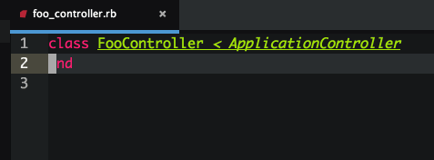

linter-rails-best-practices
=========================


This linter plugin for [Linter](https://github.com/AtomLinter/Linter) provides
an interface to
[rails_best_practices](https://github.com/railsbp/rails_best_practices) tool.
It will be used with files that have the `Ruby`, `Rails`, `ERB`, `Haml`, `Slim`,
`RABL` syntax.

## Installation
Linter package must be installed in order to use this plugin. If Linter is not
installed, please follow the instructions
[here](https://github.com/AtomLinter/Linter).

### rails_best_practices installation
```
$ gem install rails_best_practices
```

### Plugin installation
```
$ apm install linter-rails-best-practices
```

## Settings
You can configure linter-rails-best-practices by editing ~/.atom/config.cson (choose Open Your Config in Atom menu):
#### executablePath
```
'linter-rails-best-practices':
  'executablePath': null # path to rails_best_practices executable.
```
 Use `which rails_best_practices` to find it out.
 if you using rbenv run `rbenv which rails_best_practices`

## Contributing
If you would like to contribute enhancements or fixes, please do the following:

1. Fork the plugin repository.
1. Hack on a separate topic branch created from the latest `master`.
1. Commit and push the topic branch.
1. Make a pull request.

Please note that modifications should follow these coding guidelines:

- Indent is 2 spaces.
- Code should pass coffeelint linter.
- Vertical whitespace helps readability, don’t be afraid to use it.

Thank you for helping out!
